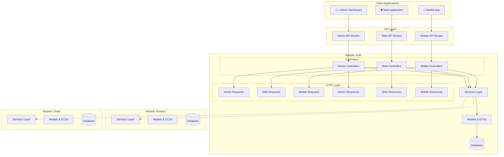

# 🏗️ Laravel SOA Starter

<p align="center">
  
  
  
  
</p>

A **Service-Oriented Architecture (SOA)** starter template built on Laravel 12, featuring a **modular monolith** design pattern with comprehensive service layer architecture, automated discovery, and enterprise-grade patterns.

## 🎯 **Project Vision**

This starter template provides a solid foundation for building scalable, maintainable Laravel applications using SOA principles and modular architecture. It emphasizes clean separation of concerns, testability, and developer productivity through intelligent code generation and consistent patterns.

## ✨ **Key Features**

### 🏛️ **Modular Architecture**
- **Modular Monolith Design** - Self-contained modules with clear boundaries
- **Service-Oriented Architecture** - Business logic encapsulated in dedicated services  
- **Client-Type Separation** - Routes, controllers, requests, and resources organized by client (Admin/Web/Mobile)
- **Code Generation Commands** - Automated scaffolding with `make:controller`, `make:request`, `make:resource`, `make:dto`
- **Automatic Module Discovery** - Routes, migrations, and services auto-registered

### 🔧 **Advanced Service Layer**
- **BaseService Pattern** - Consistent transaction handling and error management
- **Single Responsibility Services** - Each service handles one specific action
- **Comprehensive Validation** - Request validation moved to service layer
- **Standardized Response Format** - Uniform API responses across all endpoints
- **Client-Optimized Responses** - Tailored data structures for Admin, Web, and Mobile clients

### 🧪 **Testing & Quality**
- **Modular Test Structure** - Tests organized per module
- **Comprehensive Test Coverage** - Unit and feature tests included
- **Factory Discovery System** - Automatic model factory resolution

### 📱 **Client-Type Architecture**
- **Multi-Client Support** - Separate API endpoints for Admin, Web, and Mobile clients
- **Optimized Performance** - Client-specific controllers reduce unnecessary processing
- **Targeted Responses** - Resources tailored for each client's data requirements
- **Separation of Concerns** - Admin features isolated from public web/mobile interfaces
- **Maintainability** - Easy to modify client-specific logic without affecting others
- **Security** - Clear boundaries between administrative and public functionality

### 🗄️ **Database Architecture**  
- **Module-Specific Databases** - Each module manages its own migrations, factories, seeders
- **Automatic Factory Discovery** - `HasModularFactory` trait eliminates boilerplate
- **Migration Organization** - Clear separation of database concerns per module

### 🎨 **Developer Experience**
- **Comprehensive Code Generation** - Controllers, requests, resources, and DTOs with consistent patterns
- **Rich Documentation** - Comprehensive guides and architectural documentation  
- **Naming Conventions Consistency** - Snake_case variables, proper suffixes, and organized namespacing
- **Clean Architecture** - Clear separation between controllers, services, models, and client types

## 🏗️ **Architecture Overview**



## 📁 **Project Structure**

```
├── app/
│   ├── Console/Commands/
│   │   ├── Database/                      # Database related commands
│   │   │   └── MigrateFresh.php
│   │   └── Make/                          # Code generation commands
│   │       ├── MakeControllerCommand.php
│   │       ├── MakeRequestCommand.php
│   │       ├── MakeResourceCommand.php
│   │       └── MakeDtoCommand.php
│   ├── Services/
│   │   └── BaseService.php                # Base service with common functionality
│   ├── Http/Traits/
│   │   └── ApiResponse.php                # Standardized API responses
│   └── Traits/
│       └── HasModularFactory.php          # Automatic factory discovery
├── modules/
│   └── Auth/                              # Example Auth module
│       ├── DTOs/                          # Data Transfer Objects
│       │   ├── User/Requests/             # Request DTOs
│       │   └── User/Responses/            # Response DTOs
│       ├── Http/
│       │   ├── Controllers/Api/           # Client-specific controllers
│       │   │   ├── Admin/                 # Admin controllers
│       │   │   ├── Web/                   # Web controllers
│       │   │   └── Mobile/                # Mobile controllers
│       │   ├── Requests/Api/              # Client-specific form requests
│       │   │   ├── Admin/User/            # Admin user requests
│       │   │   ├── Web/User/              # Web user requests
│       │   │   └── Mobile/User/           # Mobile user requests
│       │   └── Resources/Api/             # Client-specific JSON resources
│       │       ├── Admin/User/            # Admin user resources
│       │       ├── Web/User/              # Web user resources
│       │       └── Mobile/User/           # Mobile user resources
│       ├── Services/                      # Business logic layer
│       │   ├── Auth/                      # Authentication services
│       │   └── User/                      # User management services
│       ├── Models/                        # Eloquent models
│       ├── Database/                      # Module-specific database files
│       │   ├── Migrations/
│       │   ├── Factories/
│       │   └── Seeders/
│       └── Tests/                         # Module tests
├── docs/
│   ├── MODULAR_DATABASE.md              # Database architecture guide
└── README.md
```

## 🚀 **Getting Started**

### Prerequisites
- PHP 8.3+
- Laravel 12.x
- PostgreSQL (preferably)/MySQL/SQLite

### Installation

1. **Clone the repository**
   ```bash
   git clone https://github.com/yourusername/laravel-soa-starter.git
   cd laravel-soa-starter
   ```

2. **Install dependencies**
   ```bash
   composer install
   ```

3. **Environment setup**
   ```bash
   cp .env.example .env
   php artisan key:generate
   ```

4. **Database setup**
   ```bash
   php artisan migrate
   php artisan db:seed
   ```

5. **Run the application**
   ```bash
   php artisan serve
   ```

### Creating Your First Module

Generate a new module with all necessary files:

```bash
php artisan make:module Product
```

This creates a complete module structure with:
- Controllers with CRUD operations
- Service layer with validation
- DTOs for data transfer
- Models with factory discovery
- Database migrations, factories, seeders
- Feature and unit tests
- API routes

### Generating Components

Create client-specific components for your modules:

```bash
# Generate controllers for different clients
php artisan make:controller Product Product Admin
php artisan make:controller Product Product Web
php artisan make:controller Product Product Mobile

# Generate form requests
php artisan make:request Product Product StoreProduct Admin
php artisan make:request Product Product UpdateProduct Web

# Generate JSON resources  
php artisan make:resource Product Product ProductList Admin
php artisan make:resource Product Product ProductCard Web

# Generate DTOs
php artisan make:dto Product Product CreateProduct request
php artisan make:dto Product Product ProductDetail response
```

## 🏗️ **Architecture Patterns**

### Service Layer Architecture
```php
// Each service extends BaseService for consistency
class CreateProductService extends BaseService
{
    protected function rules(): array
    {
        return [
            'name' => 'required|string|max:255',
            'price' => 'required|numeric|min:0',
        ];
    }
    
    protected function process(mixed $dto): void
    {
        // Business logic here
        $product = Product::create($dto);
        $this->results['data'] = ProductResponseDTO::fromModel($product);
    }
}
```

### Modular Factory Discovery
```php
// Models automatically discover their factories
class Product extends Model
{
    use HasModularFactory; // Automatically finds Modules\Product\Database\Factories\ProductFactory
}
```

### Client-Specific Architecture
```php
// Admin Controller - Full access with detailed responses
class AdminProductController extends ApiController
{
    public function index(): JsonResponse
    {
        $products = Product::with(['category', 'createdBy'])->get();
        return $this->response([
            'products' => AdminProductListResource::collection($products)
        ]);
    }
}

// Web Controller - Public-safe data only
class WebProductController extends ApiController
{
    public function index(): JsonResponse
    {
        $products = Product::active()->get();
        return $this->response([
            'products' => WebProductCardResource::collection($products)
        ]);
    }
}

// Mobile Controller - Optimized for bandwidth
class MobileProductController extends ApiController
{
    public function index(): JsonResponse
    {
        $products = Product::active()->select(['id', 'name', 'price'])->get();
        return $this->response([
            'products' => MobileProductResource::collection($products)
        ]);
    }
}
```

## 📊 **Current Status**

- ✅ **Core Architecture** - Modular SOA foundation complete
- ✅ **Client-Type Separation** - Admin/Web/Mobile architecture implemented
- ✅ **Auth Module** - Complete authentication system with JWT
- ✅ **Service Layer** - BaseService pattern with comprehensive error handling  
- ✅ **Code Generation Suite** - Commands for controllers, requests, resources, DTOs
- ✅ **Factory Discovery** - Automatic model factory resolution
- ✅ **Testing Framework** - Modular test structure with comprehensive coverage
- ✅ **Modular Localization** - Translation system integrated per module

## 🗺️ **Roadmap & Future Plans**

### Phase 1: Core Enhancements
- [ ] **API Rate Limiting** - Comprehensive rate limiting per module/endpoint
- [ ] **Caching Layer** - Redis-based caching with cache tags per module
- [ ] **Event System** - Module-to-module communication via events
- [ ] **Permission System** - Role-based access control (RBAC)

### Phase 2: Advanced Features
- [ ] **API Versioning** - Support for multiple API versions
- [ ] **Queue System** - Background job processing per module
- [ ] **File Management** - File upload/storage service with cloud support
- [ ] **Notification System** - Multi-channel notifications (email, SMS, push)

### Phase 3: DevOps & Monitoring
- [ ] **Docker Support** - Complete containerization setup
- [ ] **CI/CD Pipeline** - GitHub Actions for automated testing and deployment
- [ ] **Monitoring & Logging** - Comprehensive application monitoring
- [ ] **Performance Optimization** - Database query optimization and caching strategies

### Phase 4: Enterprise Features
- [ ] **Multi-tenancy** - SaaS-ready tenant isolation
- [ ] **Microservice Migration Path** - Tools to split modules into microservices
- [ ] **API Gateway** - Centralized API management and routing
- [ ] **Distributed Tracing** - Request tracing across modules

## 🤝 **Contributing**

We welcome contributions! Please see our [contributing guidelines](CONTRIBUTING.md) for details.

### Development Setup
1. Fork the repository
2. Create a feature branch (`git checkout -b feature/amazing-feature`)
3. Commit your changes (`git commit -m 'Add amazing feature'`)
4. Push to the branch (`git push origin feature/amazing-feature`)
5. Open a Pull Request

## 🧪 **Testing**

Run the test suite:
```bash
# Run all tests
vendor/bin/phpunit

# Run specific module tests
vendor/bin/phpunit modules/Auth/Tests/

# Run with coverage
vendor/bin/phpunit --coverage-html coverage/
```

## 📚 **Documentation**

Comprehensive documentation is available in the [`docs/`](docs/) folder, including:
- **Architecture Guides** - Modular database and localization patterns
- **Command Documentation** - Detailed guides for all code generation commands
- **Best Practices** - Development patterns and conventions

Key documentation:
- [Command Reference](docs/commands/) - All available artisan commands
- [Modular Database](docs/MODULAR_DATABASE.md) - Database architecture patterns

## 🙏 **Acknowledgments**

Special thanks to the following developers for their inspiration, suggestions, and contributions to this project:

- **[@lazuardy347](https://github.com/lazuardy347)** - For architectural insights and design pattern suggestions
- **[@praneshaw](https://github.com/praneshaw)** - For modular design pattern inspiration and feedback
- **[@dimasaprasetyo](https://github.com/dimasaprasetyo)** - For helpful libraries, packages, and tools recommendations.

Their expertise and guidance have been invaluable in shaping this project's architecture and implementation.

## 📄 **License**

This project is licensed under the MIT License - see the [LICENSE](LICENSE) file for details.

## 💡 **Support**

- 📧 **Email**: [dafarizky34@gmail.com](mailto:dafarizky34@gmail.com)
- 🐛 **Issues**: [GitHub Issues](https://github.com/dafalagi/laravel-soa-starter/issues)
- 💬 **Discussions**: [GitHub Discussions](https://github.com/dafalagi/laravel-soa-starter/discussions)

---

<p align="center">
  <strong>Built with ❤️ using Laravel and modern PHP practices</strong>
</p>
